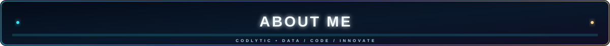
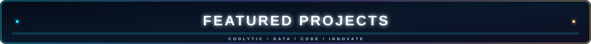
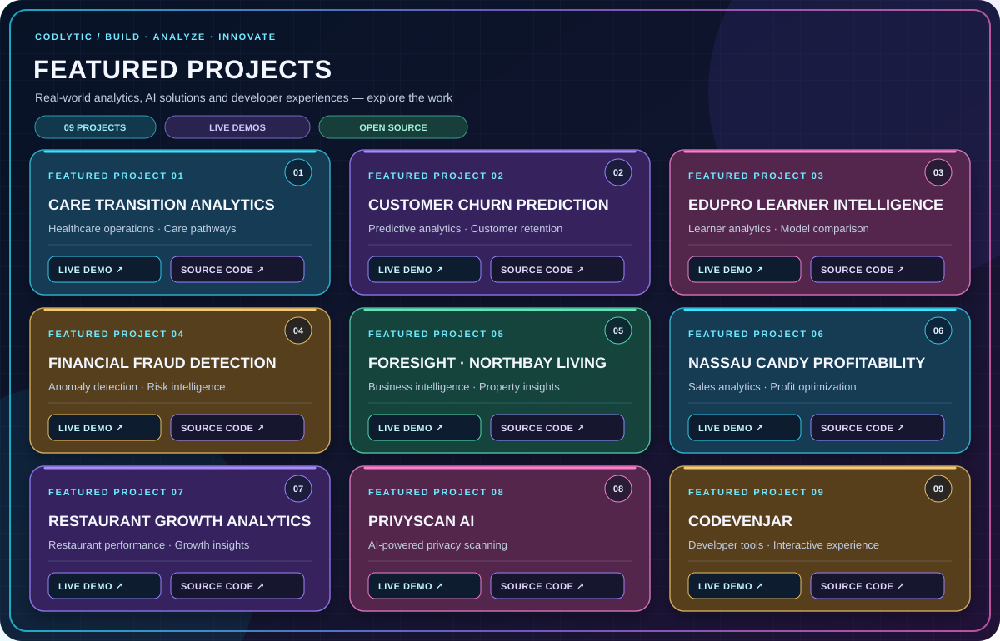
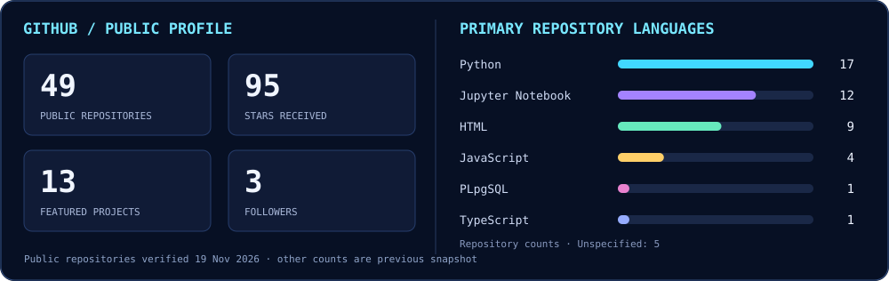
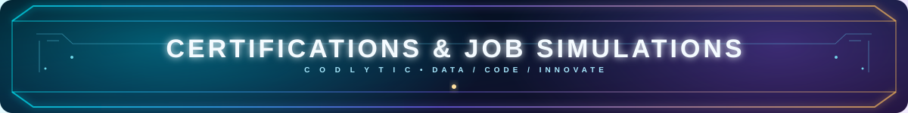
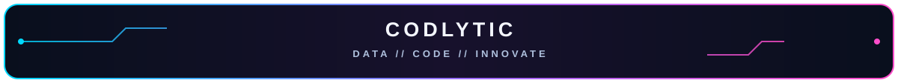

<!-- CODLYTIC | GitHub Profile README -->

<!-- HERO -->

  

  
  
  
  

  
  
  

<!-- ABOUT -->

  

  

<!-- TOOLKIT -->

  

  

  
  
  
  
  

<!-- FEATURED PROJECTS -->

  

<strong>SELECTED WORK</strong> · Analytics, AI, and developer projects.

  

<!-- GITHUB ACTIVITY -->

  

  

  

  

  <a href="https://github.com/Nitesh-Datascience?tab=repositories">Browse repositories</a>
  &nbsp;·&nbsp;
  <a href="https://github.com/Nitesh-Datascience?tab=stars">Starred repositories</a>

<!-- CERTIFICATIONS -->

  

  

<!-- MORE -->

  

  <a href="https://nitesh-datascience.github.io/universe-portfolio/">Universe Portfolio</a>
  &nbsp;·&nbsp;
  <a href="https://github.com/Nitesh-Datascience/universe-portfolio">Portfolio source</a>
  &nbsp;·&nbsp;
  <a href="https://nitesh-datascience.github.io/portfolio/">Main portfolio</a>
  &nbsp;·&nbsp;
  <a href="https://nitesh-datascience.github.io/Nitesh-Tree-Portfolio/">Tree portfolio</a>

<!-- CONNECT -->

  

  
  

  

